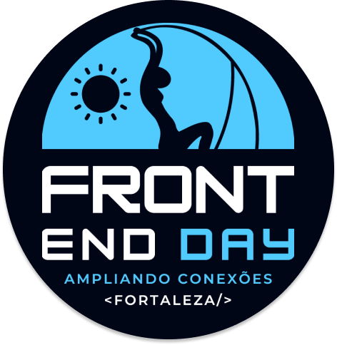

# FrontEnd-Day-App  

Bem-vindo ao Repositório do Frontend Day App!

Este projeto foi uma estratégia cuidadosamente planejada, avançando em relação ao que já tínhamos no site Front-End Day. O foco principal foi no formato mobile, mas também o elaboramos pensando no formato desktop. Em apenas um mês, desenvolvemos o design no Figma e o implementamos, contando com a orientação e monitoria do nosso professor Abraão Alves. O principal desafio foi o prazo, o qual nos forçou a pensar com inteligência para determinar o que era viável ou não, ou seja, o que seria ou não opcional.

As principais funcionalidades do aplicativo incluem a animação do cronograma já disponível no site do Front-End Day, juntamente com um recurso de busca que auxilia o usuário a encontrar um palestrante específico ou um horário determinado.

(Mostrar aqui a tela da função de busca: Gif).

A segunda funcionalidade consiste em criar uma aba de cronograma personalizada, permitindo que cada usuário escolha o cronograma que deseja seguir.

(Mostrar aqui a tela de salve, com o cronograma personalizável: Gif).

## Pré-requisitos

- Node.js 18
- npm 9
- Git

> O projeto está disponível através do GitHub CodeSpace, acesse:

## Rodando o Projeto

1. `npm install` - instala todas as dependências
2. `npm run dev` - roda o projeto em modo de desenvolvimento
3. `npm start` - roda o projeto em modo de pré-visualização

Link para a [documentação](https://doc-frontend-day-app.vercel.app).

Atenciosamente, Open Rage.
