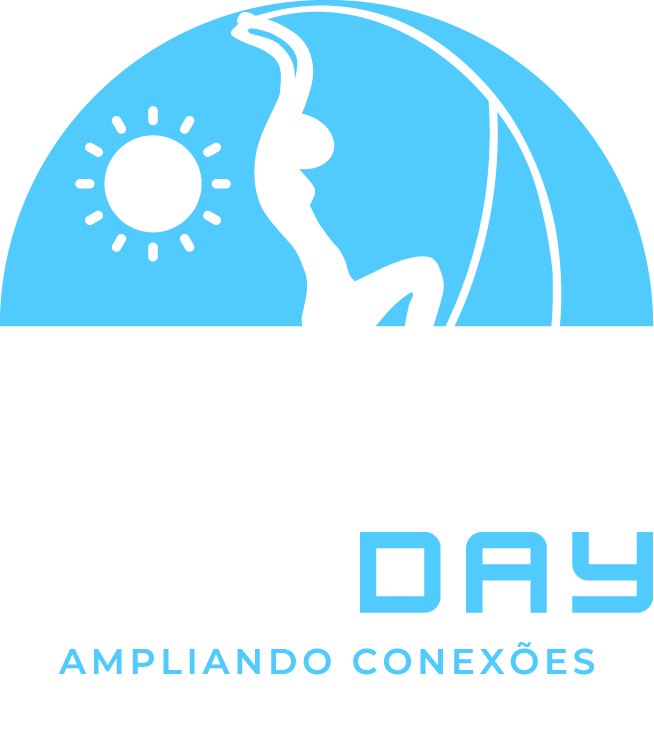

# FrontEnd-Day-App  

Bem-vindo ao Repositório do Frontend Day App! 

O projeto foi uma estratégia planejada à frente do que já tínhamos no site Front-End Day, com foco principal no formato mobile, mas também elaborado pensando no formato desktop. Em apenas 1 mês, desenvolvemos o design no Figma e implementamos, contando com a orientação e monitoria do nosso professor Abraão Alves. O principal desafio foi o prazo, o qual nos limitou a pensar com inteligência para definir o que era viável ou não, ou seja, o que seria ou não opcional.

As principais funcionalidades do aplicativo são a animação do cronograma já disponível no site do Front-End Day, com um recurso de busca que auxilia o usuário a encontrar um palestrante específico ou um horário determinado.

(Mostrar aqui a tela da função de search: Gif).

A segunda funcionalidade consiste em criar uma aba de cronograma personalizada, permitindo que cada usuário escolha o cronograma que deseja seguir.

(Mostrar aqui a tela de salve, com o cronograma personalizavel: Gif).

# Pré-requisitos

- nodejs 18
- npm 9
- git

> O projeto está disponível através do Githut CodeSpace, acesse:

## Rodando o Projeto

1. `npm install` instala todas as dependências
2. `npm run dev` roda o projeto em modo de desenvolvimento
3. `npm start` roda o projeto em modo de preview

Link para a [documentação](https://doc-frontend-day-app.vercel.app) sobre.

Atenciosamente, Open Rage.
